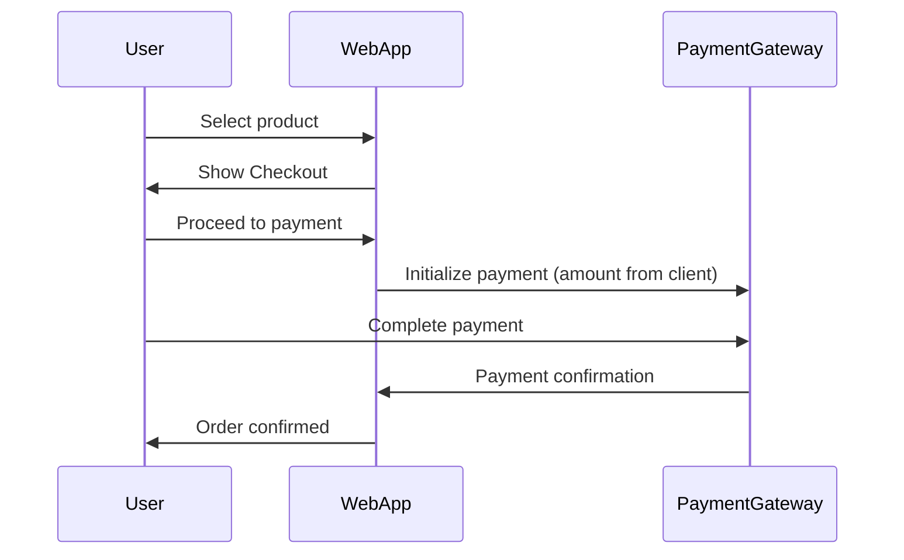
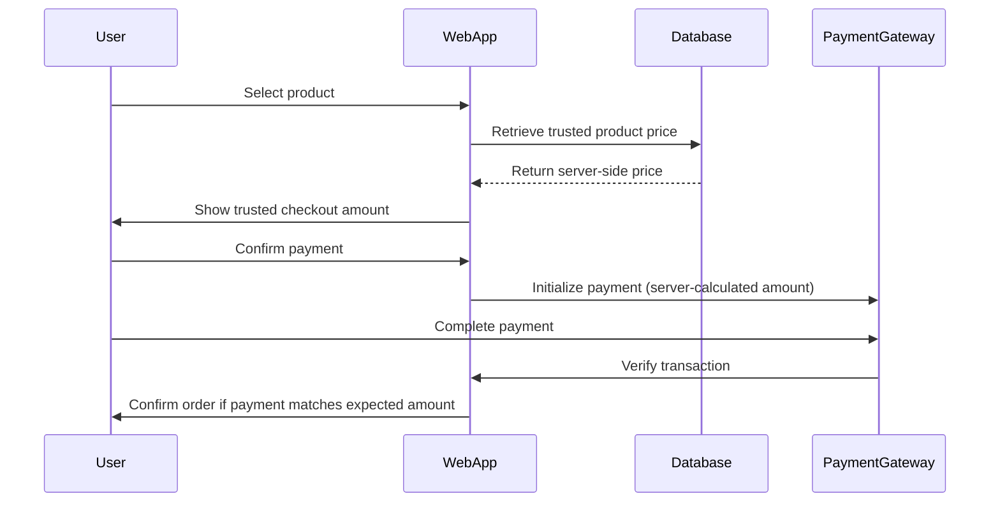

# Payment Amount Manipulation in Checkout Flow
While testing a web application's checkout process, I observed that the payment initiation request sent to the payment gateway included an `amount` parameter.
To understand whether this value was enforced by the backend or simply forwarded to the gateway, the request was intercepted and modified before being forwarded.
After forwarding the modified request, the payment interface generated by the gateway reflected the tampered value rather than the original order price.

## Target Disclosure
The name of the affected application has been intentionally redacted. This case study focuses on the technical aspects of the vulnerability and the security lessons derived from the testing process.

## Overview
During checkout, the application generated a request to the payment gateway in order to initialize the payment.
The request included several parameters used by the gateway to create the payment interface, including the transaction amount.
To determine whether this value was validated by the backend or simply forwarded to the gateway, the request was intercepted and the `amount` parameter was modified before being forwarded.
After forwarding the modified request, the payment interface generated by the gateway reflected the tampered value rather than the original order price.

## Vulnerability Classification
The issue can be classified as a *Business Logic Vulnerability* involving *Client-Side Price Manipulation* in the checkout process.
The application allowed a financial parameter (amount) to be influenced by a client-controlled request during payment initialization. Because the server did not strictly derive the payable amount from trusted backend data, it was possible to manipulate the transaction value before it reached the payment gateway.
This resulted in a scenario where the payment interface reflected a modified amount rather than the actual order price.

## Attack Scenario
The issue could be reproduced by intercepting the payment initialization request during checkout.
A simplified attack flow is shown below:

1. A user initiates checkout for a product.
2. The application generates a payment initialization request.
3. The request is intercepted using a proxy tool.
4. The `amount` parameter is modified before forwarding the request.
5. The payment gateway interface reflects the modified amount instead of the expected order value.

## Payment Flow Diagram (Original Vulnerable Design)

## Secure Payment Flow Diagram (Recommended Design)

## Technical Analysis
During checkout, the application generated a request to initialize a payment session with the payment gateway.
The request contained several parameters used by the gateway to generate the payment interface.
Example request structure:

key: `<public payment key>`

email: `<customer email>`

amount: `60000`

currency: `NGN`

metadata: `{ referral: ... }`

mode: `popup`

first_name: `<customer name>`

last_name: `<customer name>`

ref: `<order reference>`

Testing showed that the amount parameter could be modified before the request reached the payment gateway.

For example: `amount 60000` ---> `amount 60`

After forwarding the modified request, the payment interface generated by the gateway displayed the modified value instead of the original order price.

## Impact
Because the payment amount could be modified before the request reached the payment gateway, it was possible to complete transactions using a lower amount than the actual order value.
By intercepting the payment initialization request and modifying the `amount` parameter, the payment interface generated by the gateway reflected the manipulated value. The transaction could then be completed using this lower amount.
Since the backend accepted the payment as valid and confirmed the order, this behavior allowed purchases to be completed for significantly less than the intended price.
This represents a payment integrity issue, as financial values relied on a client-controlled parameter during the payment process.

## Root Cause
The issue occurred because the payment workflow relied on a client-supplied financial parameter when initiating the transaction.
Although the application used identifiers such as product codes, item IDs, and order references to represent items in the system, the transaction amount sent to the payment gateway was not strictly derived from trusted server-side data.
Instead, the amount value present in the client request was forwarded during payment initialization.
Because this parameter could be modified before reaching the payment gateway, the payment process relied on a value that originated from the client rather than a server-calculated order total.

## Secure Design Recommendation
To prevent this class of vulnerability, financial values used during payment initialization must never originate from client-controlled input.
Instead, the backend should derive the payable amount directly from trusted server-side data such as product identifiers or order records stored in the database.
A secure payment workflow should follow this pattern:

1. The client submits only the product identifier or order reference.
2. The backend retrieves the corresponding product information from the database.
3. The backend calculates the correct total price.
4. The backend initializes the payment request using the server-calculated amount.
5. After payment, the backend verifies the transaction details with the payment provider before confirming the order.

Under this design, the client cannot influence the payable amount because all pricing decisions are enforced on the server.

## Key Security Lesson
This issue highlights a common design mistake in payment integrations: trusting financial parameters supplied by the client.
Even when product identifiers and order references exist in the system, allowing the client to influence the transaction amount can undermine the integrity of the checkout process.
Secure payment systems must treat the server as the single source of truth for all financial values. Client requests should only provide identifiers, while all pricing calculations and payment initialization logic must be enforced on the backend.

## Testing Methodology
The issue was identified through manual testing of the checkout flow using an intercepting proxy.
The payment initialization request was intercepted and modified before reaching the payment gateway. By altering the `amount` parameter, the payment interface generated by the gateway reflected the manipulated value.
Further testing confirmed that the application initially relied on this client-supplied value during the checkout process.

